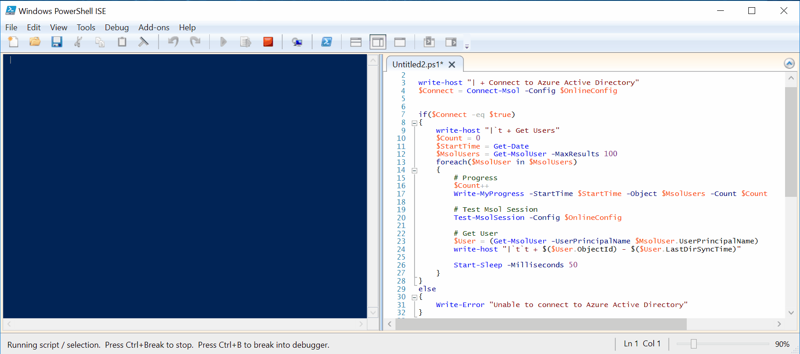

# Connect-Msol



## SYNOPSIS  
Simple script to connect into Microsoft Online

## NOTES  
  - **File Name**   : Invoke-ConnectMsol.ps1
  - **Author**      : Thomas ILLIET, contact@thomas-illiet.fr
  - **Date**        : 2017-08-06
  - **Last Update** : 2017-08-06
  - **Tested Date** : 2017-10-16
  - **Version**     : 1.0.2
    
## REQUIRE
  - Software :
    - Microsoft Online Services Sign-In Assistant
      - https://www.microsoft.com/en-us/download/details.aspx?id=41950
    - Azure Active Directory PowerShell V1
      - http://connect.microsoft.com/site1164
    
## EXAMPLE
```
    #----------------------------------------------
    # Authentification : Plain Password
    #----------------------------------------------
    $OnlineConfig =@{
        Identity       = "unicorn@microsoft.fr"
        Password       = "BeatifullUnicorne!"
    }
    Invoke-ConnectMsol -Config $OnlineConfig
```

```
    #----------------------------------------------
    # Authentification : SecureString file
    #----------------------------------------------
    $OnlineConfig =@{
        Identity       = "unicorn@microsoft.fr"
        PasswordFile   = "c:\Securestring.txt"
    }
    Invoke-ConnectMsol -Config $OnlineConfig
```

```
    #----------------------------------------------
    # Authentification : SecureString file + Key
    #----------------------------------------------
    $OnlineConfig =@{
        Identity       = "unicorn@microsoft.fr"
        PasswordFile   = "C:\Securestring.txt"
        KeyFile        = "C:\MyCertificat.key"
    }
    Invoke-ConnectMsol -Config $OnlineConfig
```